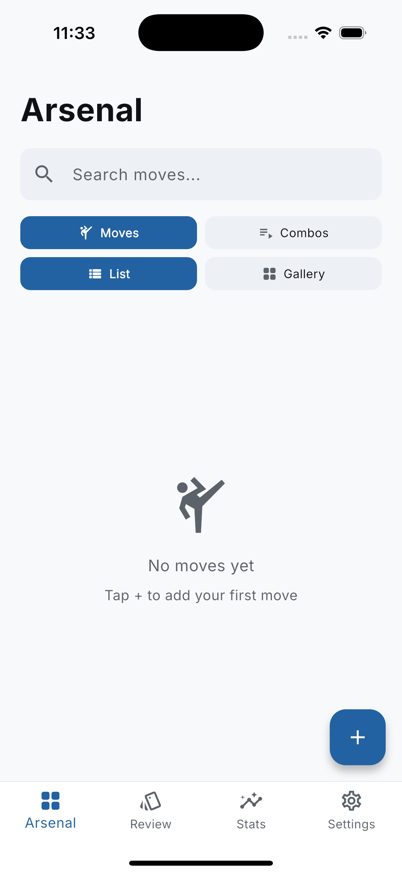
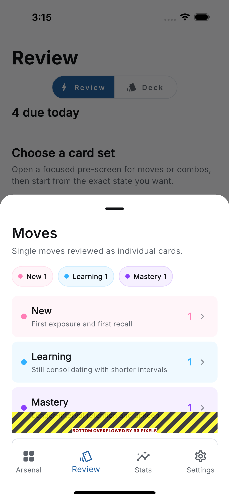
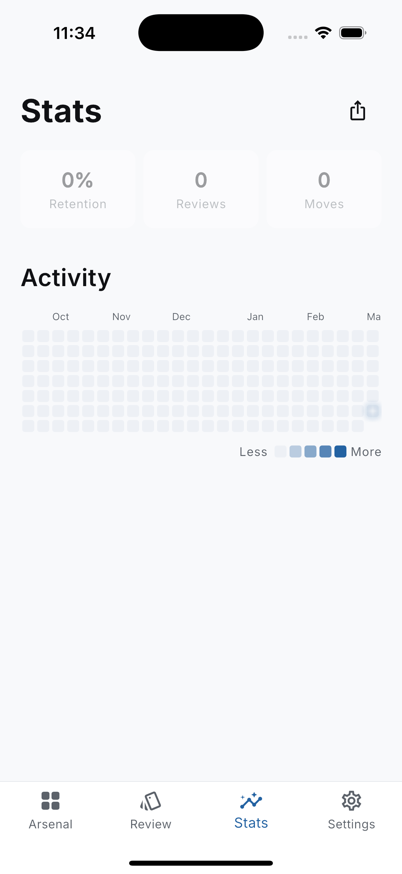
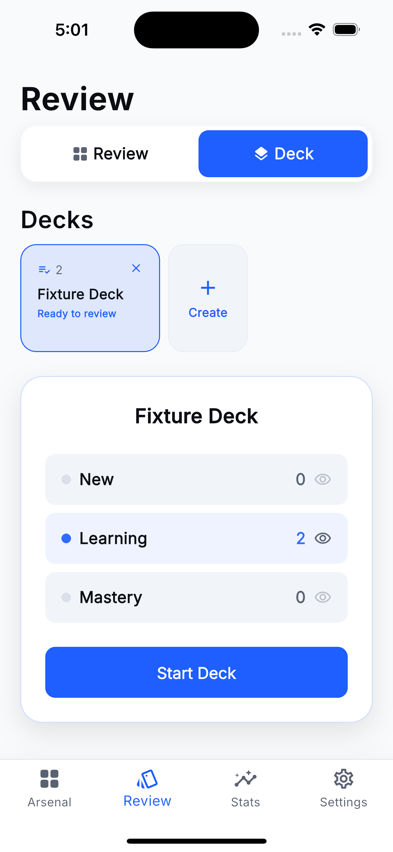
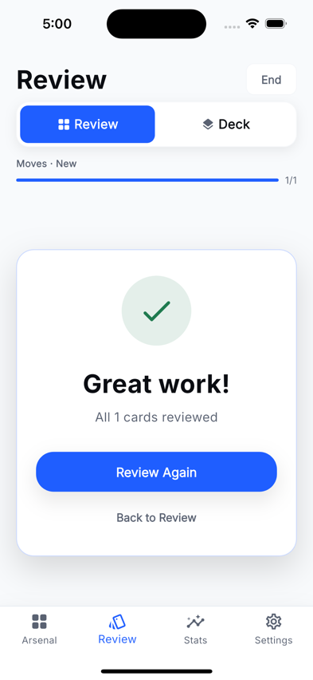
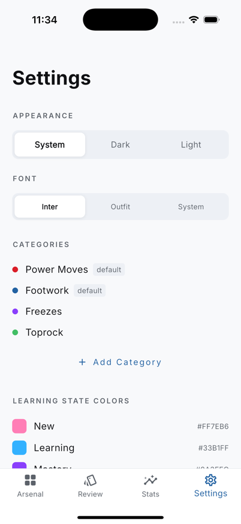

<h1 align="center">Breakdex</h1>

<p align="center">
  <em>A pocket video database for dance moves, combos, and spaced-repetition review.</em>
</p>

<p align="center">
  <a href="https://github.com/stussysenik/breakdex-flutter/actions/workflows/release.yml">
    
  </a>
  
  
</p>

---

## About


Breakdex combines a move library, combo builder, video editor, deck-based practice, and review analytics into a single Flutter app. It uses spaced-repetition (FSRS) to schedule reviews so you practice the moves you need most, right when you need them.

## Features

### Arsenal

Store atomic moves and combo sequences with category semantics, searchable in both list and gallery views. Video-first creation flow: pick or record, trim, name, and save.

### Review

State-based and deck-based sessions with per-card progression. Four response grades (Again, Hard, Good, Easy) drive the FSRS scheduler to optimize your retention.

### Stats

Track card counts by learning state, response quality distribution, timeline history, and retention curves. Reactive dashboard updates live after each review.

### Settings

Configure themes, manage categories, rename views, and control sync and export preferences.

## Screenshots

<table>
  <tr>
    <td align="center"><strong>Arsenal</strong></td>
    <td align="center"><strong>Review</strong></td>
    <td align="center"><strong>Stats</strong></td>
  </tr>
  <tr>
    <td></td>
    <td></td>
    <td></td>
  </tr>
  <tr>
    <td align="center"><strong>Deck Review</strong></td>
    <td align="center"><strong>Completion</strong></td>
    <td align="center"><strong>Settings</strong></td>
  </tr>
  <tr>
    <td></td>
    <td></td>
    <td></td>
  </tr>
</table>

## Getting Started

```bash
flutter pub get
flutter run
```

For release mode on a connected device:

```bash
flutter run --release -d <device-id>
```

## Architecture

| Layer | Technology |
|-------|-----------|
| **Storage** | Drift (SQLite) with versioned migrations |
| **State** | Riverpod providers with stream-based reactivity |
| **Scheduling** | FSRS 2.0 spaced-repetition algorithm |
| **Routing** | GoRouter with deep linking |
| **Design** | Inter font, AppColors/AppSpacing/AppTypography tokens |
| **Animation** | flutter_animate with motion constants |

## Testing

End-to-end tests use [Maestro](https://maestro.mobile.dev) with tag-based groups:

```bash
# Run all E2E tests
maestro test .maestro/

# Run by tag
maestro test --tags=smoke .maestro/
maestro test --tags=review .maestro/
maestro test --tags=arsenal .maestro/
maestro test --tags=performance .maestro/
maestro test --tags=regression .maestro/
maestro test --tags=settings .maestro/
```

INP latency measurement:

```bash
bash scripts/inp-measure.sh
```

## Release

This project uses [semantic-release](https://github.com/semantic-release/semantic-release) for automated versioning. Conventional commit messages on `main` trigger the pipeline:

1. **Analyze** commits since last release
2. **Generate** changelog from commit messages
3. **Bump** version in `pubspec.yaml`
4. **Publish** GitHub release with changelog

Commit prefixes: `feat:` (minor), `fix:` (patch), `perf:` (patch), `BREAKING CHANGE` (major).

## License

ISC
