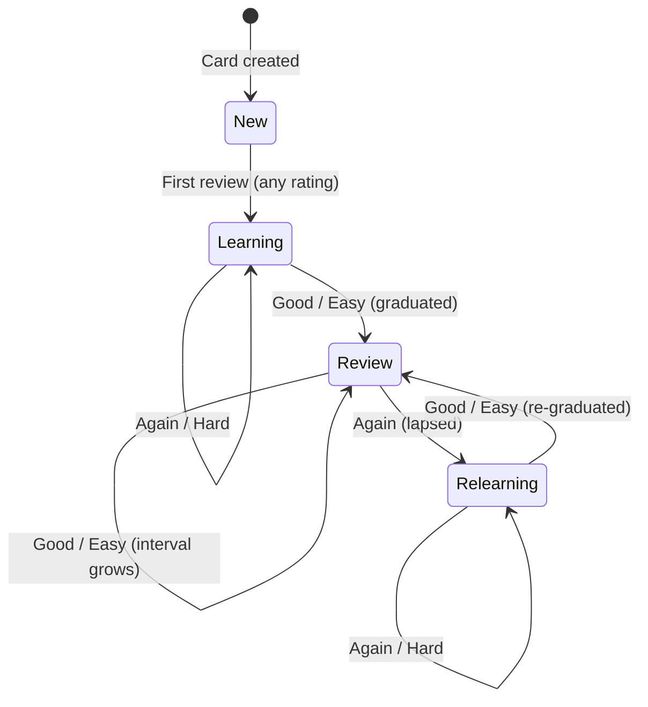
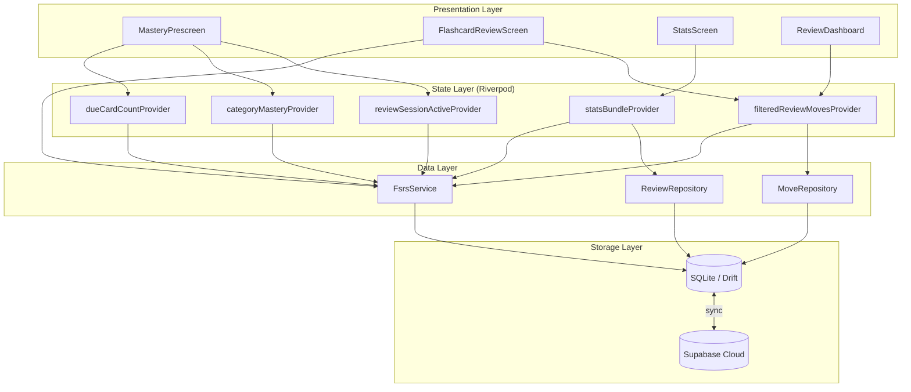
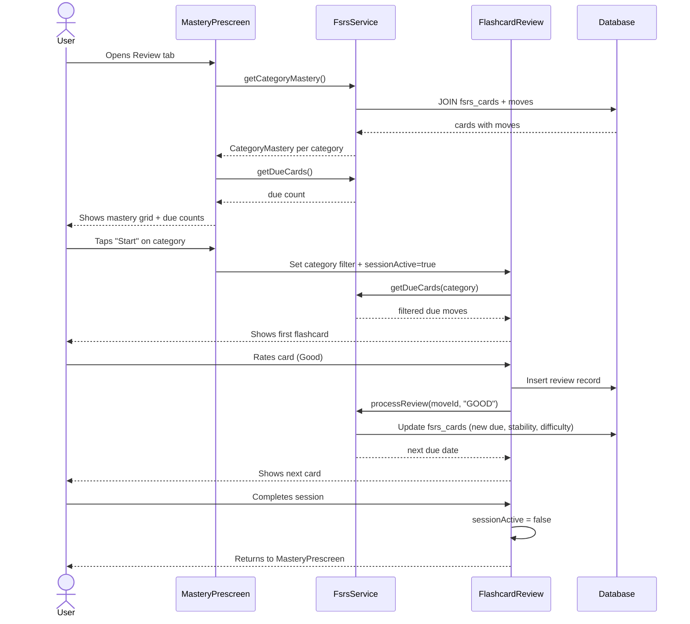

# Breakdex Architecture

## Entity Relationship Diagram

```mermaid
erDiagram
    MOVES ||--o| FSRS_CARDS : "1:1 scheduling"
    MOVES ||--o{ REVIEWS : "1:N history"
    MOVES }o--|| CATEGORIES : "belongs to"
    COMBOS ||--o{ COMBO_MOVES : "has sequence"
    COMBO_MOVES }o--|| MOVES : "references"
    BATTLE_RESULTS ||--o{ MOVES : "reviews"
    SYNC_LOG ||--o| MOVES : "tracks changes"
    SYNC_LOG ||--o| COMBOS : "tracks changes"
    SYNC_LOG ||--o| REVIEWS : "tracks changes"

    MOVES {
        text id PK
        text name
        text learningState "NEW|LEARNING|MASTERY (legacy)"
        text category
        text videoPath
        datetime createdAt
    }

    FSRS_CARDS {
        text moveId PK_FK
        real stability "memory strength"
        real difficulty "item difficulty 0-10"
        datetime due "next review date"
        datetime lastReview
        int reps "consecutive correct"
        int lapses "times forgotten"
        int fsrsState "0=New 1=Learning 2=Review 3=Relearning"
    }

    REVIEWS {
        text id PK
        text rating "AGAIN|HARD|GOOD|EASY"
        text reviewType "MOVE|COMBO|MANUAL"
        datetime reviewedAt
        text moveId FK
    }

    CATEGORIES {
        text name PK
        int colorValue
    }
```

## FSRS State Machine



## Data Flow



## Review Flow Sequence


